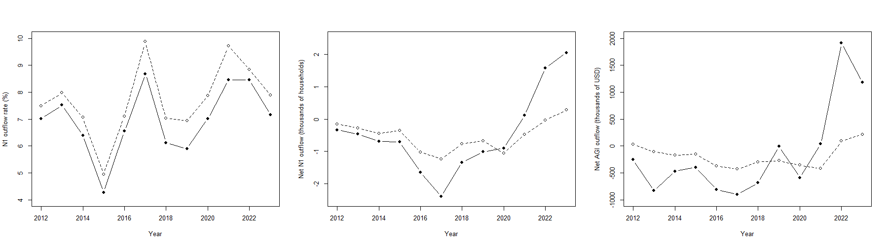

# The Effect of Washington's 2021 Capital Gains Tax on Wealth Migration

On May 4, 2021, Washington State Governor Jay Inslee signed Senate Bill 5096 into law, creating a 7% capital gains tax effective January 1, 2022. This repo contains the data pipeline and analysis used to quantify the causal effect of this policy on wealth migration.

**Paper:** [Read the full paper](https://drive.google.com/file/d/1KiKjG4HskirD6ZxklH8-1iwy5tTWYWSm/view?usp=sharing)

## Abstract

On May 4, 2021, Washington State established a 7% capital gains tax on gains in excess of $250,000. In this paper, we estimate the causal effect of this policy on the out-migration of high-income taxpayers from Washington. We employ a differences-in-differences design comparing Washington to a synthetic control state, matched on pre-treatment migration trends among low-income taxpayers. We estimate that the capital gains tax caused 0.9% more high-income taxpayers from Washington to leave in 2021, a net loss of over 1,000 high-income households and $1.37 million in adjusted gross income, and confirm the significance of this estimate with a permutation placebo test.

## Parallel Trends

## Repository Structure

- `analysis/` — R scripts for data processing, synthetic control matching, and difference-in-differences estimation
- `data/` — raw and cleaned IRS SOI migration data
- `artifacts/` — intermediate and final output tables (control weights, coefficients, placebo distributions)
- `figures/` — generated plots used in the paper
